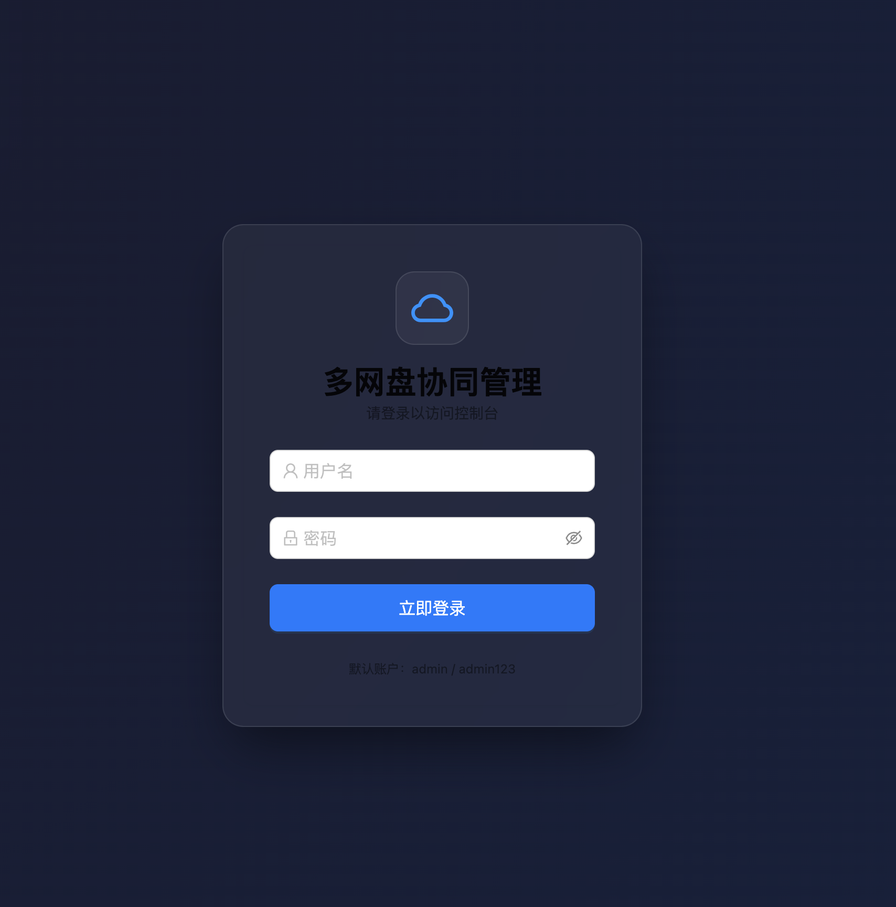
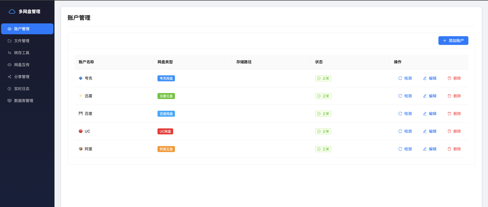
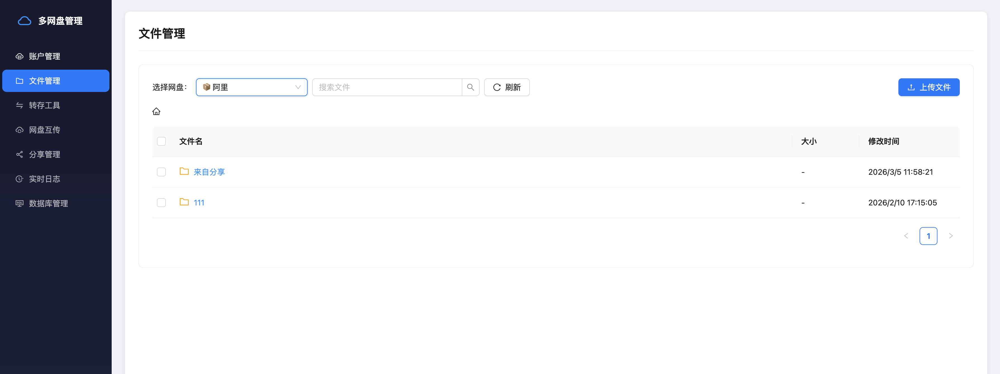
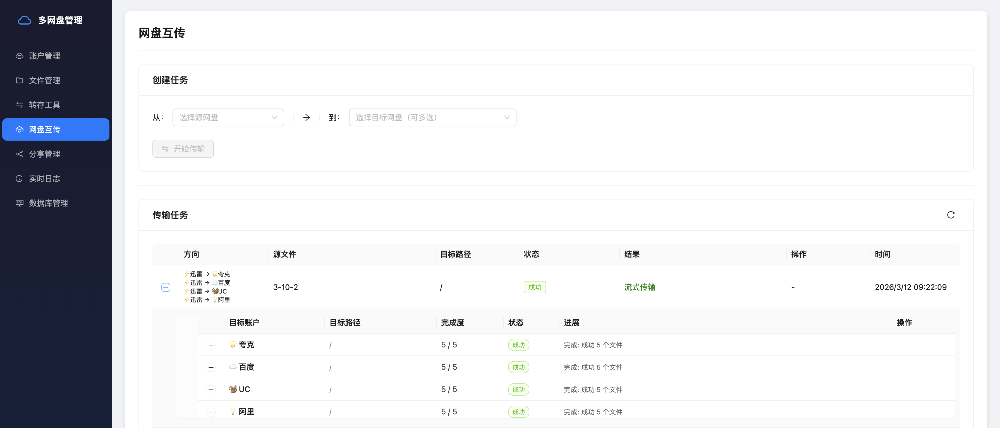
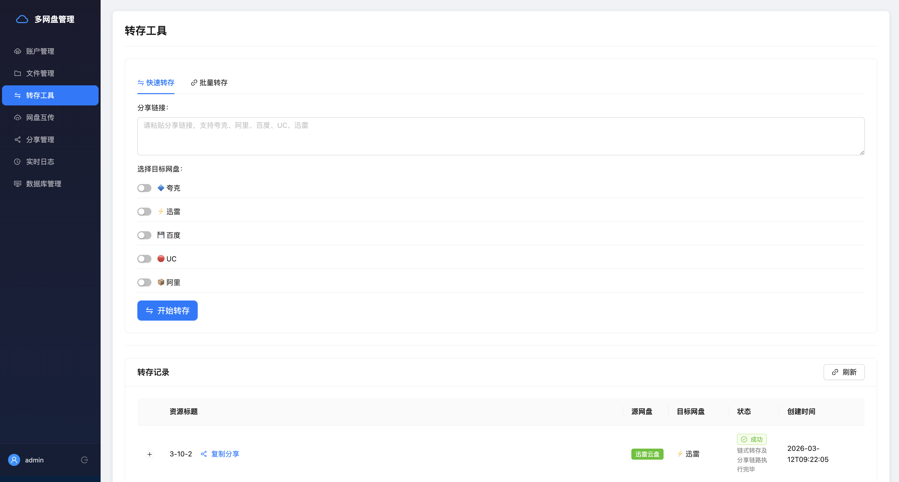
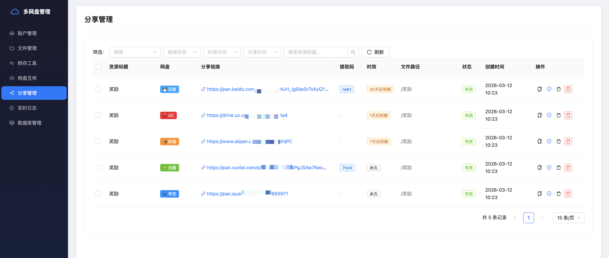

# ☁️ 多网盘协同管理系统 (Multi-Pan Manager)

<p align="center">
  
</p>

<p align="center">
  
  
  
  
</p>

## 🌟 项目简介

**Multi-Pan Manager** 是一个专注于**多账号统一调度、跨盘高速互传、实时任务监控**的旗舰级个人云盘网关。它深度整合了各主流网盘的底层协议，解决了账号孤岛、转存繁琐、进度不可见等核心痛点。

> [!CAUTION]
> **使用须知与免责声明**
> 1. **严禁商用**：本系统仅供个人学习、研究及资源整理使用，**禁止任何形式的商业盈利行为**（包括但不限于通过本工具进行倒卖账号、付费代转资源等）。
> 2. **数据责任**：请遵守各网盘平台的服务协议。开发者对用户因违规操作导致的封号、数据丢失等后果不承担任何法律责任。
> 3. **版权保护**：请尊重正版资源，禁止利用本工具分发非法/侵权内容。

---

## 🔥 核心特性

*   **分片流式中转 (Chunk-Streaming)**：跨盘互传采用内存分片流引擎，无需在服务器磁盘完全落地即可实现“即下即传”，在保证极低磁盘占用的同时实现全速运转。
*   **多源多向并发分发 (Multi-Distribution)**：不仅支持将本地文件**同时上传至多个不同平台**, 更支持将某一网盘内的源文件一键并发转存、跨云迁移至多个目标网盘账户中，轻松构建个人数据的多重互备网络。
*   **深层目录递归无损重建**：配备强大的目录层级解析算法，支持包含嵌套子文件夹在内的工作目录一键上传/互传，全自动在各大云盘中无损还原复杂本地目录树。
*   **智能高阶批量批处理操作**：
    *   **提取码感知转存 (Smart Transfer)**：搭载正则解析模块，自动识别包含提取码在内的多种繁杂分享链，实现全自动的资源提取与一键极速批量转存规划。
    *   **矩阵聚合分享生成 (Matrix Sharing)**：跨账户、跨网盘随意勾选多个孤立文件，实现极速打包并聚合导出独立的公共分享链接网。
*   **多盘聚合管理中心**：使用统一、流线型的单界面即可全盘操作夸克、阿里、百度、UC、迅雷等国内外主流云盘。
*   **实时 SSE 传输态势感知**：基于服务端推送 (SSE) 协议，打破轮询延迟，在 Web 端实时以毫秒级刷新各大网盘在传输过程中的并发进度与系统日志。
*   **内置全能运维管控台 (Built-in Console)**：告别繁琐的服务器 SSH 登录，Web UI 直接集成全功能 SQLite 数据库可视化观测台与全量系统级终端运行日志回显。
*   **企业级会话级安全防护**：全路由接口搭载高防护 JWT 会话校验；内建 `slowapi` 流量清洗模块防范暴力登录；前端更是启用零信任理念下的极客级 `SHA-256` 预哈希技术，在传输侧彻底杜绝明文密匙外泄风险。

---

## 📸 界面导览 (Screenshots)

<details open>
  <summary><b>系统登录 (防暴力破解接入)</b></summary>
  <p align="center">
    <!-- Replace this placeholder with the actual image path, e.g., assets/login.png -->
    
  </p>
</details>

<details open>
  <summary><b>账户管理 (多盘聚合视图)</b></summary>
  <p align="center">
    
  </p>
</details>

<details open>
  <summary><b>文件管理 (分片流式上传)</b></summary>
  <p align="center">
    
  </p>
</details>

<details open>
  <summary><b>网盘互传 (跨盘多点分发)</b></summary>
  <p align="center">
    
  </p>
</details>

<details open>
  <summary><b>转存工具 (主流网盘资源链批量转存)</b></summary>
  <p align="center">
    
  </p>
</details>

<details open>
  <summary><b>分享管理 (聚合网盘分享链管控)</b></summary>
  <p align="center">
    
  </p>
</details>

---

## 🛠 核心技术平台 (Tech Stack)

### 🎛 服务端引擎 (Backend)
*   **网关接入**: `FastAPI` (极具现代感的高性能异步通信屏障)
*   **持久层控制**: `SQLite` 搭档 `SQLAlchemy` (轻量化本地单点隔离存储库)
*   **通信与防护**: `Server-Sent Events` (毫秒级日志与传输进度推送); `slowapi` & `passlib` (防暴力侵入与高强度盐析换算)

### 💻 交互工作台 (Frontend)
*   **视图重构**: `React 18` 与全家桶路由基座 (`React Router v6`)
*   **UI 动态化**: `Ant Design` (流式响应全栈组件库)
*   **数据链路防护**: `Web Crypto API` (前端发送前的零信任凭证阻断加密)

---

## 📂 项目模块地图 (Architecture)

```text
multi-pan-manager/
├── backend/                  # 🚀 FastAPI 异步并发节点
│   ├── app/
│   │   ├── api/              # 流式处理、统一代理路由群
│   │   ├── core/             # JWT、日志抓手、IP洗盘防护网
│   │   ├── services/         # 网盘暗黑协议解构层 (多源解析调度器)
│   │   └── database.py       # 离线单库数据引擎
│   └── run.py                # 服务生命周期启动器
└── frontend/                 # 🌌 React 泛终端可视化大屏
    └── src/
        ├── components/       # 公共业务胶水件 (路径树解析器、鉴权哨兵)
        ├── pages/            # 分发总台及各大独立功能域视图
        └── services/         # 融合 Token 验证的 Axios 访问层
```

---

## 🏗 环境要求

| 维度 | 最低配置 | 推荐配置 |
| :--- | :--- | :--- |
| **CPU** | 1 核 (x86_64 / ARM64) | 2 核+ |
| **内存** | 512MB (系统可用) | 2GB+ |
| **磁盘** | 100MB 基础占用 | 2GB+ (建议 SSD 提升 `temp_data` 性能) |
| **系统** | Linux / macOS / Windows / Docker | Docker (推荐) |

---

## 🚀 部署指南

### 方式一：Docker 部署 (生产环境推荐 🚀)
1. **克隆仓库代码**
   ```bash
   git clone https://github.com/qi777777/multi-pan-manager.git
   cd multi-pan-manager
   ```
2. **初始化环境配置** (⚠️ 必须执行)
   ```bash
   cp backend/.env.example backend/.env
   # 请酌情修改 .env 中的配置，如自定义运行端口或加密秘匙
   ```
3. **一键编排启动**
   ```bash
   docker-compose up -d
   ```
   *   **访问节点**：`http://localhost:3000` (或您在配置中指定的对外端口)
   *   **初始化凭证**：默认管理员账户名 `admin`，密码 `admin123`。强烈建议在初始登录后前往系统设置立刻重置！

---

### 方式二：手动部署 (开发调试模式)

#### 1. 后端环境 (Python 3.10+)

**Linux / macOS:**
```bash
cd backend
# 1. 创建并激活虚拟环境
python3 -m venv venv
source venv/bin/activate

# 2. 安装项目依赖
pip install -r requirements.txt

# 3. 配置文件初始化 (执行拷贝后，请编辑 .env 修改 SECRET_KEY)
cp .env.example .env 

# 4. 启动后端服务器
python3 run.py
```

**Windows:**
```powershell
cd backend
# 1. 创建并激活虚拟环境
python -m venv venv
.\venv\Scripts\activate

# 2. 安装项目依赖
pip install -r requirements.txt

# 3. 配置文件初始化 (执行拷贝后，请编辑 .env 修改 SECRET_KEY)
copy .env.example .env

# 4. 启动后端服务器
python run.py
```

#### 2. 前端环境 (Node.js 18+)
```bash
cd frontend
# 1. 安装核心框架及 UI 组件
npm install 

# 2. 启动前端开发服务器
npm run dev
```

---

## ⚙️ 配置文件说明 (.env)

系统通过 `backend/.env` 进行细粒度配置。**首次部署时必须执行以下步骤：**

1.  **激活模板**：执行 `cp backend/.env.example backend/.env` (或 Windows 下使用 `copy`)。
2.  **配置密钥**：修改 `SECRET_KEY`。保持默认值会导致登录态在多实例或重启后失效，且存在安全隐患。
3.  **调试模式**：生产环境中确保 `DEBUG=false`。

---

## ❓ 常见问题 (FAQ)

**Q: 为什么上传进度条上方显示的文件名不一样？**
A: 本系统支持真正的并发分发。不同网盘的接口响应速度不一，系统会实时反馈每个账号当前正在处理的真实文件名，确报进度“所见即所得”。

**Q: Nginx 反向代理下进度条不动？**
A: 请确保关闭了代理缓冲，否则 SSE 消息会被延迟拦截：
```nginx
proxy_buffering off;
proxy_read_timeout 3600s;
```

---

## 💖 致谢与开源参考 (Credits)

本项目的诞生离不开以下优秀项目的原理启发与协议分析方案：

*   **[LinkSwift](https://github.com/hmjz100/LinkSwift)**：网盘 API 逆向及多账户调度模型。
*   **[QuarkPan](https://github.com/lich0821/QuarkPan)**：夸克网盘协议层实现参考。
*   **[BaiduPCS-Py](https://github.com/PeterDing/BaiduPCS-Py)**：百度网盘文件路径转换逻辑参考。
*   **[Quark2Baidu](https://github.com/pjx1314/Quark2Baidu)**：秒传逻辑参考。
*   **[xinyue-search](https://github.com/675061370/xinyue-search)**：部分加密指纹提取参考。

---

## 💬 交流 & 讨论

加入交流群，与更多开发者交流学习！

📌 **添加微信** `rangli777` 添加时请备注来源（如果项目对你有所帮助，也可以请我喝杯咖啡 ☕️ ~）

📌 **扫码加入交流群** 👇

| 扫码加入交流群 | 支持项目 (请喝咖啡) |
| :---: | :---: |
|  |  |

> **温馨提示**：项目代码已免费开源，欢迎学习和交流。由于个人时间有限，暂不提供一对一的免费搭建指导。如有问题可在群内交流讨论，或私信咨询。
